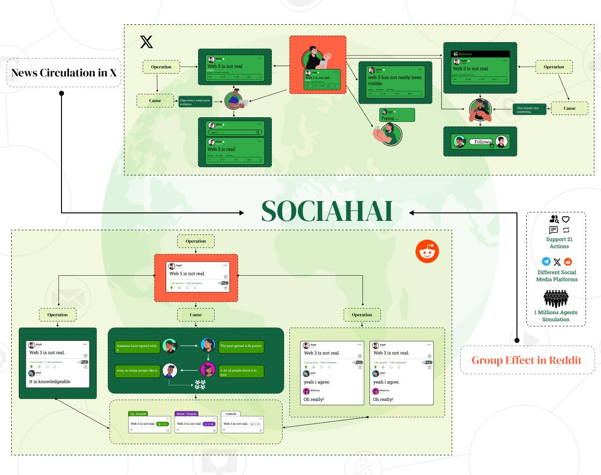

# Sociah: 1 Million AI Agents. Endless Possibilities.

<p align="center">
  
</p>

<p align="center">
  <a href="https://sociah.ai/dashboard">Dashboard</a> |
  <a href="https://sociah.ai/">Website</a> |
  <a href="https://github.com/SociahAI">GitHub</a> |
</p>


## 📝 Overview

<p align="center">
  
</p>
Socius is an AI-driven social simulation platform where autonomous agents interact at scale, generating dynamic conversations, behaviors, and emergent social structures. It builds upon the foundation of the original [Original Project Name] while introducing unique enhancements tailored for large-scale AI social interactions.

### Key Features

At the heart of Sociah is a powerful suite of AI models trained on vast datasets to decode social dynamics, trends, and algorithmic influence. These models power:

Real-time simulations
Predictive analytics
Autonomous AI interactions
Current Models
sociah-8bn (Latest)
An 8-billion parameter model designed for deep contextual understanding, real-time narrative shifts, and large-scale discourse analysis.

Key Capabilities:

Identifies key influencers and opinion leaders
Tracks emerging narratives in real-time
Analyzes sentiment evolution patterns
Maps information flow networks
Technical Specs:

8B parameters
2048 token context window
Multi-modal understanding
Real-time processing
sociah-deepseek-r1 (Beta)
Leveraging DeepSeek AI, this model specializes in pattern recognition, sentiment shifts, and viral trajectory prediction.

Key Capabilities:

Forecasts content virality potential
Detects coordinated behavior patterns
Predicts trend trajectories
Analyzes behavioral clusters
Technical Specs:

DeepSeek-based architecture
4096 token context window
Advanced pattern recognition
Streaming inference support
sociah-ds-r1 (Preview)
Optimized for large-scale AI agent interactions, capable of simulating complex social dynamics and modeling millions of conversations.

Key Capabilities:

Simulates diverse agent personalities
Models echo chamber formation
Replicates debate dynamics
Generates emergent behaviors
Technical Specs:

Distributed simulation engine
Million-agent scalability
Real-time interaction modeling
Dynamic behavior adaptation
Future Roadmap
sociah-scale
Next-generation scaling capabilities with 100B+ parameters, enabling deeper understanding of complex social phenomena and emergent behaviors.

sociah-quantum
Research initiative exploring quantum computing applications for social simulation, aiming to model unprecedented complexity levels.


## 🔧 Installation

### Step 1: Clone the Repository

```bash
git clone https://github.com/SociahAI/sociah-8bn-local.git

cd sociah-8bn-local
```

### Step 2: Create and Activate a Virtual Environment

Please choose one of the following methods to set up your environment. You only need to follow one of these methods.

- Option 1: Using Conda (Linux & macOS & windows)

```bash
conda create --name sociah python=3.10
conda activate sociah
```

- Option 2: Using venv (Linux & macOS)

```bash
python -m venv sociah-venv
source sociah-venv/bin/activate
```

- Option 3: Using venv (Windows)

```bash
python -m venv sociah-venv
sociah-venv\Scripts\activate
```

### Step 3: Install Necessary Packages

```bash
pip install --upgrade pip setuptools

pip install -e .  # This will install dependencies as specified in pyproject.toml
```

## 🏃Quickstart (using Sociah API)

### Step 1: Set Up Environment Variables

First, you need to add your Sociah API key to the system's environment variables. You can obtain your Sociah API key from [here](https://Sociah.ai/dashboard). Note that the method for doing this will vary depending on your operating system and the shell you are using.

- For Bash shell (Linux, macOS, Git Bash on Windows):\*\*

```bash
# Export your OpenAI API key
export SOCIAH_API_KEY=<insert your SOCIAH API key>
export SOCIAH_API_BASE_URL=<insert your SOCIAH API base url> 
```

- For Windows Command Prompt:\*\*

```cmd
REM export your Sociah API key
set SOCIAH_API_KEY=<insert your Sociah API key>
set SOCIAH_API_BASE_URL=<insert your Sociah API base url> 
```

- For Windows PowerShell:\*\*

```powershell
# Export your Sociah API key
$env:SOCIAH_API_KEY="<insert your Sociah API key>"
$env:SOCIAH_API_BASE_URL="<insert your Sociah API BASE URL>" 
```

### Step 3: Run the Main Program

```bash

# For Twitter
python scripts/twitter_local_example/twitter_simulation_large.py --config_path scripts/twitter_local_example/gpt_example.yaml
```

## 📘 Comprehensive Guide (For Open Source Models)

We assume that users are conducting large-scale experiments on a Slurm workload manager cluster. Below, we provide the commands for running experiments with open-source models on the Slurm cluster. The steps for running these experiments on a local machine are similar.

### Step 1: Download Open Source Models

Taking the download of LLaMA-3 from Hugging Face as an example:

```bash
pip install huggingface_hub

huggingface-cli download --resume-download "meta-llama/Meta-Llama-3-8B-Instruct" --local-dir "YOUR_LOCAL_MODEL_DIRECTORY" --local-dir-use-symlinks False --resume-download --token "YOUR_HUGGING_FACE_TOKEN"
```

Note: Please replace "YOUR_LOCAL_MODEL_DIRECTORY" with your actual directory path where you wish to save the model and "YOUR_HUGGING_FACE_TOKEN" with your Hugging Face token. Obtain your token at https://huggingface.co/settings/tokens.

### Step 2: Request GPUs and Get Information

Ensure that the GPU memory you're requesting is sufficient for deploying the open-source model you've downloaded. Taking the application for an A100 GPU as an example:

```bash
salloc --ntasks=1 --mem=100G --time=11:00:00 --gres=gpu:a100:1
```

Next, obtain and record the information of that node. Please ensure that the IP address of the GPU server can be accessed by your network, such as within the school's internet.

```bash
srun --ntasks=1 --mem=100G --time=11:00:00 --gres=gpu:a100:1 bash -c 'ifconfig -a'
"""
Example output:
eth0: flags=4163<UP,BROADCAST,RUNNING,MULTICAST>  mtu 1500
       inet 10.109.1.8  netmask 255.255.255.0  broadcast 192.168.1.255
       ether 02:42:ac:11:00:02  txqueuelen 0  (Ethernet)
       RX packets 100  bytes 123456 (123.4 KB)
       RX errors 0  dropped 0  overruns 0  frame 0
       TX packets 100  bytes 654321 (654.3 KB)
       TX errors 0  dropped 0 overruns 0  carrier 0  collisions
"""

srun --ntasks=1 --mem=100G --time=11:00:00 --gres=gpu:a100:1 bash -c 'echo $CUDA_VISIBLE_DEVICES'
"""
Example output: 0
"""
```

Document the IP address associated with the eth0 interface, which, in this example, is `10.109.1.8`. Additionally, note the identifier of the available GPU, which in this case is `0`.

### Step 3: Deploying vLLM

Based on the IP address and GPU identifier obtained from step 2, and the model path and name from step 1, modify the `hosts`, `gpus` variables, and the `'YOUR_LOCAL_MODEL_DIRECTORY'`, `'YOUR_LOCAL_MODEL_NAME strings'` in the `deploy.py` file. For example:

```python
if __name__ == "__main__":
    host = "10.109.1.8"  # input your IP address
    ports = [
        [8002, 8003, 8005],
        [8006, 8007, 8008],
        [8011, 8009, 8010],
        [8014, 8012, 8013],
        [8017, 8015, 8016],
        [8020, 8018, 8019],
        [8021, 8022, 8023],
        [8024, 8025, 8026],
    ]
    gpus = [0]  # input your $CUDA_VISIBLE_DEVICES

    all_ports = [port for i in gpus for port in ports[i]]
    print("All ports: ", all_ports, '\n\n')

    t = None
    for i in range(3):
        for j, gpu in enumerate(gpus):
            cmd = (
                f"CUDA_VISIBLE_DEVICES={gpu} python -m "
                f"vllm.entrypoints.openai.api_server --model "
                f"'YOUR_LOCAL_MODEL_DIRECTORY' "  # input the path where you downloaded your model
                f"--served-model-name 'YOUR_LOCAL_MODEL_NAME' "  # input the name of the model you downloaded
                f"--host {host} --port {ports[j][i]} --gpu-memory-utilization "
                f"0.3 --disable-log-stats")
            t = threading.Thread(target=subprocess.run,
                                 args=(cmd, ),
                                 kwargs={"shell": True},
                                 daemon=True)
            t.start()
        check_port_open(host, ports[0][i])
    t.join()
```

Next, run the `deploy.py` script. Then you will see an output, which contains a list of all ports.

```bash
srun --ntasks=1 --time=11:00:00 --gres=gpu:a100:1 bash -c 'python deploy.py'
"""
Example output:
All ports:  [8002, 8003, 8005]

More other output about vllm...
"""
```

### Step 4: Modify the Configuration File

Before the simulation begins, you need to enter your model name, model path, host, and ports into the corresponding yaml file in the experiment script such as `scripts\reddit_simulation_align_with_human\business_3600.yaml`. An example of what to write is:

```yaml
inference:
  model_type: 'YOUR_LOCAL_MODEL_NAME'  # input the name of the model you downloaded (eg. 'llama-3')
  model_path: 'YOUR_LOCAL_MODEL_DIRECTORY'  # input the path where you downloaded your model
  stop_tokens: ["<|eot_id|>", "<|end_of_text|>"]
  server_url:
    - host: "10.109.1.8"
      ports: [8002, 8003, 8005]  # Input the list of all ports obtained in step 3
```

Additionally, you can modify other settings related to data and experimental details in the yaml file. For instructions on this part, refer to `scripts\reddit_gpt_example\gpt_example.yaml`.


## 🖺 License

The source code is licensed under Apache 2.0.

## 📬 Contact

If you're keen on exploring new research opportunities or discoveries with our platform and wish to dive deeper or suggest new features, we're here to talk. Feel free to get in touch for more details at support@sociah.ai.